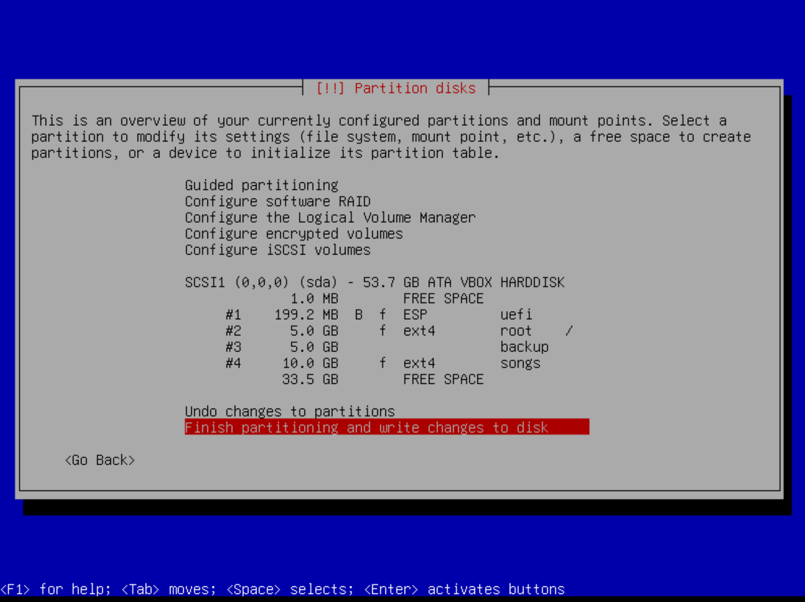

# NOT READY YET


# Introduction

This tool is designed to automate the process of setting up a
dedicated **ITG Machine** within a **Debian GNU Linux**
environment. The objective is to operate it on a standalone machine
without any other users or programs.

**ITGMania** and several essential utilities will be deployed on the
machine. Auto login and auto start will be configured.

# WARNING

Certain actions performed by this tool involve managing machine's disk
and partitions. Exercise caution when using this tool. There are no
guarantees provided.

# Install Debian

## Prepare USB Drive

Installer expects you install minimal **GNU Debian Linux** version
**using netinst cd image**.

Use, for example, the following link:
https://cdimage.debian.org/cdimage/daily-builds/daily/arch-latest/amd64/iso-cd/debian-testing-amd64-netinst.iso

Or you can take a full CD/DVD installation. It depends on required
software at the very early stage. For example you need to install
**network manager** with WiFi support. Minimal Debian installation
does not have **network manager** or **wpa_supplicant**.

## Firmware

Non free firmware is not included into Debian Installer by
default. Download them if needed:
https://cdimage.debian.org/cdimage/firmware/trixie/20240701/firmware.tar.gz

## Network

If network is not available (because firmware is missing) ignore it
and proceed without network configuration. We will deal with it later.

## Setup user

Installer creates default user and it will be used for running **ITG Machine**.
By default `itg` user will be used.

## UEFI

**ITG Machine** is running with `UEFI` without GRUB. If you don't have
hardware with `UEFI` support just keep grub and don't select `Install
kernel to UEFI partition`.

## Disk

*NOTE: My first intention was to create machine with hidden partition for backup/restore purpose.*
*Despite the fact I implement this complicated logic, after pondering about it, I decided to drop this.*
*If you think you need backup/restore just do it in your way and I keep installer simpler.*

There is not strict disk layout required. Do it like you want. Here is some recommendation:

- Force UEFI Installation: **YES**, if possible
- Make sure you have EFI boot partition
- Preferred partition table type is **GPT**.
- If you plan to backup/restore OS, put `/home` on separate partition makes it easy to backup only OS by backing up only `/`
- If you have separate `/home` you should backup files separately. If you wish. Or just machine profile. Maybe be in next versions
- For running **ITGMania** with enough RAM swap is not required


For example at the end it should like this (I used VirtualBox, but
your partitions should have different size).




## Reboot

Reboot to your fresh installed system, install required firmware, etc.

# ITG Machine Installer

At this point it is expected that you have a minimal Debian system installed and running.

**Internet access** must be provided. Your options:
- Plug network cable (easiest way). Temporary. Until you install
  everything and go offline or switch to something else
- Plug your phone using USB and choose `USB Tethering` (also easy
  way). Now your phone is an old-gold modem connected to Internet. At
  least it works for Android
- You have configured Internet access somehow

*HINT: If you connected with Android or cable just type `dhclient` to
setup network. It requires only before you get your network manager.*

You need to run `instal.sh` script either by copying it or by:

`wget -O- https://raw.githubusercontent.com/jsirex/itgmachine/master/install.sh | bash -s`


# After install

If everything went fine you probably should see the following output of `df -h`:

``` bash
Filesystem      Size  Used Avail Use% Mounted on
udev            6.6G     0  6.6G   0% /dev
tmpfs           1.4G  1.8M  1.4G   1% /run
/dev/nvme0n1p2   32G  2.2G   30G   7% /
tmpfs           6.6G     0  6.6G   0% /dev/shm
efivarfs        192K  111K   77K  60% /sys/firmware/efi/efivars
tmpfs           5.0M     0  5.0M   0% /run/lock
tmpfs           6.6G     0  6.6G   0% /tmp
tmpfs           1.0M     0  1.0M   0% /run/credentials/systemd-udev-load-credentials.service
tmpfs           1.0M     0  1.0M   0% /run/credentials/systemd-journald.service
tmpfs           1.0M     0  1.0M   0% /run/credentials/systemd-tmpfiles-setup-dev-early.service
tmpfs           1.0M     0  1.0M   0% /run/credentials/systemd-sysctl.service
tmpfs           1.0M     0  1.0M   0% /run/credentials/systemd-tmpfiles-setup-dev.service
/dev/nvme0n1p4  155G  110M  155G   1% /home/itg/.itgmania/Songs
/dev/nvme0n1p1  188M   54M  134M  29% /boot/efi
tmpfs           1.0M     0  1.0M   0% /run/credentials/systemd-tmpfiles-setup.service
tmpfs           1.0M     0  1.0M   0% /run/credentials/getty@tty3.service
tmpfs           1.4G   12K  1.4G   1% /run/user/0
tmpfs           1.4G   16K  1.4G   1% /run/user/1000
```

Notice, that OS required only 2.2G
